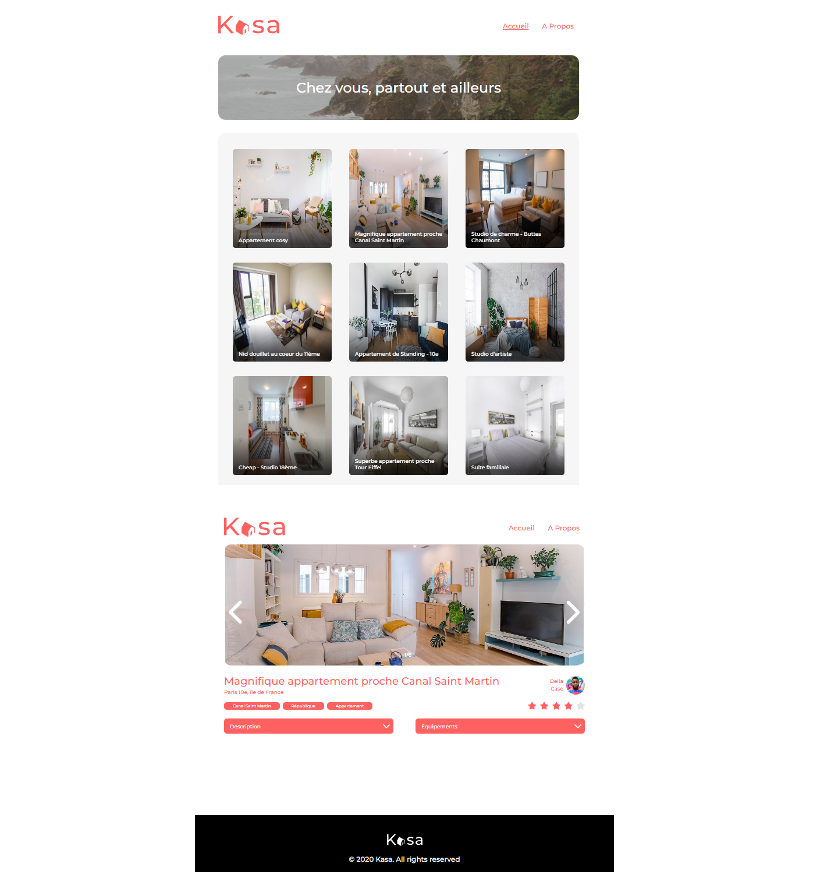

# Kasa - OCR

Project de formation chez OpenClassRoom.

#Langage solicité:

- HTML
- CSS
- SASS
- JS
- REACT

# Objectif

- Développez une application Web avec React et React Router

# Maquette

[Canevas](https://www.figma.com/file/bAnXDNqRKCRRP8mY2gcb5p/UI-Design?node-id=4%3A1)

# Visiter

[Voir le Rendu](https://nerion-1337.github.io/Kasa-OCR/)

# Aperçu

